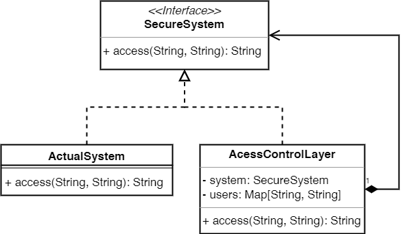
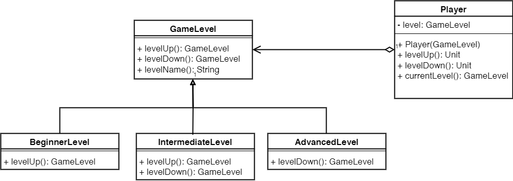
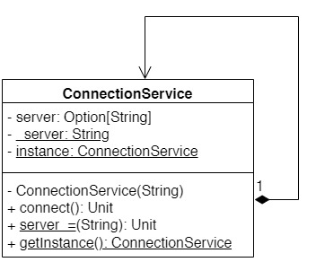
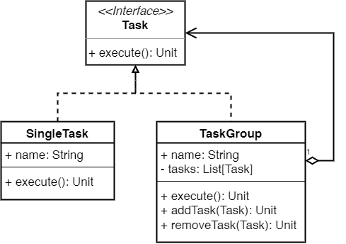

# Tabla de contenidos

- [Tabla de contenidos](#tabla-de-contenidos)
- [Parte 1: Patrones de Diseño](#parte-1-patrones-de-diseño)
  - [Ejercicio 1: Identificación de Patrones de Diseño](#ejercicio-1-identificación-de-patrones-de-diseño)
    - [Programa 2: Control de acceso](#programa-2-control-de-acceso)
    - [Programa 5: Interacción entre personajes](#programa-5-interacción-entre-personajes)
    - [Programa 7: Niveles de juego](#programa-7-niveles-de-juego)
    - [Programa 10: Servicio de Conexión](#programa-10-servicio-de-conexión)
    - [Programa 11: Gestión de tareas](#programa-11-gestión-de-tareas)
- [Parte 2: Excepciones](#parte-2-excepciones)
  - [Ejercicio 1: Clases de Excepciones](#ejercicio-1-clases-de-excepciones)
  - [Ejercicio 2: Checked vs Unchecked Exceptions](#ejercicio-2-checked-vs-unchecked-exceptions)
  - [Ejercicio 3: Buenas prácticas](#ejercicio-3-buenas-prácticas)
  - [Ejercicio 4: Manejo de Excepciones](#ejercicio-4-manejo-de-excepciones)
    - [4.1.](#41)
    - [4.2.](#42)
    - [4.3.](#43)
  - [Ejercicio 5: Orden de Ejecución](#ejercicio-5-orden-de-ejecución)
    - [5.1.](#51)
    - [5.2.](#52)
    - [5.3.](#53)
    - [5.4.](#54)
    - [5.5.](#55)
- [Parte 3: Generics](#parte-3-generics)
  - [Ejercicio 1: Clases Genéricas](#ejercicio-1-clases-genéricas)
    - [1.2.](#12)
  - [Ejercicio 2: Varianza](#ejercicio-2-varianza)
  - [Ejercicio 3: Type Constraints](#ejercicio-3-type-constraints)
    - [2. Ordenación de elementos](#2-ordenación-de-elementos)
  - [Ejercicio 4: Curiously Recurring Template Pattern](#ejercicio-4-curiously-recurring-template-pattern)

Parte 1: Patrones de Diseño
===========================

Ejercicio 1: Identificación de Patrones de Diseño
-------------------------------------------------

### Programa 2: Control de acceso

1. **Nombre del patrón:** Proxy
2. 


### Programa 5: Interacción entre personajes

1. **Nombre del patrón:** Double Dispatch
2. 


### Programa 7: Niveles de juego

1. **Nombre del patrón:** State
2. 

3. El patrón State se utiliza en este sistema para permitir que un objeto 
   `Player` cambie su comportamiento dinámicamente cuando su estado interno 
   cambia.
   En este caso, el patrón es conveniente porque permite definir transiciones
   invalidas entre estados.
  
### Programa 10: Servicio de Conexión

1. **Nombre del patrón:** Singleton
2. 


1. 
```scala
ConnectionService.server = "anakena.dcc.uchile.cl"
val connectionService = ConnectionService.getInstance()
connectionService.connect()
```

### Programa 11: Gestión de tareas

1. **Nombre del patrón:** Composite
2. 


Parte 2: Excepciones
====================

Ejercicio 1: Clases de Excepciones
----------------------------------

- `Throwable` es la clase base de todos los objetos que pueden ser lanzados y capturados por un 
  bloque `try`.
- `Exception` es la clase base de todas las excepciones que no son errores.
  Por lo general, las excepciones representan condiciones de las que un programa razonable podría 
  querer recuperarse. 
- `Error` es la clase base para las condiciones de error que una aplicación normalmente no intenta 
  capturar.
  La clase ``Error`` define excepciones que no se espera que sean capturadas bajo circunstancias 
  normales por tu programa. 
  Estas condiciones normalmente ocurren en casos donde la JVM se encuentra en un estado que no puede 
  recuperarse, como ``OutOfMemoryError``.
  Mientras que Exception y sus subclases representan condiciones excepcionales que tu programa puede
  querer capturar, ``Error`` y sus subclases representan condiciones anormales que pueden hacer que 
  tu programa se comporte de manera impredecible o incluso se bloquee. 

Ejercicio 2: Checked vs Unchecked Exceptions
--------------------------------------------

Las checked exceptions son aquellas que el compilador obliga a capturar o relanzar.
Las unchecked exceptions son aquellas que el compilador no obliga a capturar o relanzar.

En Scala no existen las checked exceptions.

Ejercicio 3: Buenas prácticas
-----------------------------

**Creación de excepciones personalizadas**

1. **Claridad:** Al usar excepciones personalizadas, puedes proporcionar más 
  detalles sobre el tipo de error que ocurrió.
  En lugar de lanzar una excepción genérica (como `RuntimeException`) con un 
  mensaje de error, puedes lanzar una excepción con un nombre descriptivo que 
  indique claramente qué salió mal.

2. **Manejo específico:** Cuando lanzas una excepción personalizada, los 
  llamadores pueden capturar y manejar específicamente esa excepción.
  Esto permite a quien llama decidir cómo manejar diferentes tipos de errores de
  una manera más controlada.

3. **Documentación:** Las excepciones personalizadas sirven como una forma de
  documentación.
  Al mirar la lista de excepciones personalizadas en tu código, puedes obtener
  una comprensión rápida de los diferentes tipos de errores que pueden ocurrir.

**Atrapar excepciones de tipo `Exception`**

1. **Demasiado amplio:** `Exception` es la superclase de todas las excepciones
  (incluyendo ``Error``, que son excepciones que no deberían ser capturadas). 
  Atrapar `Exception` significa que estás atrapando todas las excepciones, 
  incluidas las que podrías no esperar ni saber cómo manejar adecuadamente.
  Esto puede ocultar errores y hacer que el diagnóstico de problemas sea más
  difícil.

2. **Interrupción del flujo de control:** Atrapar y manejar excepciones debe
  hacerse solo cuando puedes manejarlas de manera significativa.
  Si estás atrapando todas las excepciones, estás esencialmente diciendo que tu
  código sabe cómo manejar cualquier tipo de error que pueda ocurrir, lo cual es
  poco probable y puede llevar a comportamientos inesperados.

3. **Pobre diseño:** Atrapar `Exception` es a menudo un signo de un diseño
  pobre.
  En lugar de entender y manejar las condiciones de error específicas, estás
  utilizando un enfoque de "*one size fits all*" que puede ser difícil de
  mantener y extender.

Por estas razones, es una mejor práctica capturar solo las excepciones que sabes
cómo manejar y dejar que las excepciones que no puedes manejar se propaguen
hacia arriba para que puedan manejarse en un nivel más alto o se informen como
errores no recuperables.

Ejercicio 4: Manejo de Excepciones
----------------------------------

### 4.1.

```scala
class OutOfRangeException(message: String) extends Exception(message)

def isOutOfRange(i: Int, min: Int, max: Int): Unit = {
  if (i < min || i > max) {
    throw new OutOfRangeException(s"Value $i is out of range [$min, $max]")
  }
}
```

### 4.2.

```scala
class InvalidRangeException(message: String) extends Exception(message)

def isOutOfRange(i: Int, lo: Int, hi: Int): Unit = {
  checkRange(lo, hi)
  if (i < lo || i > hi) {
    throw new OutOfRangeException(s"Value $i is out of range [$lo, $hi]")
  }
}

def checkRange(lo: Int, hi: Int): Unit = {
  if (lo >= hi) {
    throw new InvalidRangeException(s"Invalid range [$lo, $hi]")
  }
}
```

### 4.3.

```scala
object Main {
  def main(args: Array[String]): Unit = {
    while (true){
      val lo = readLine("Enter a number for the lower bound: ")
      // If all characters are digits then the input is an integer
      if (lo.forall(_.isDigit)) {
        val loNumber = lo.toInt
        val hi = readLine("Enter a number for the upper bound: ")
        if (hi.forall(_.isDigit)) {
          val hiNumber = hi.toInt
          val input = readLine(s"Enter a number: ")
          if (input.forall(_.isDigit)) {
            val number = input.toInt
            try {
              isOutOfRange(number, loNumber, hiNumber)
              println(s"Number $number is in range [$loNumber, $hiNumber]")
            } catch {
              case e: OutOfRangeException => println(e.getMessage)
              case e: InvalidRangeException => println(e.getMessage)
            }
          } else {
            return
          }
        } else {
          return
        }
      } else {
        return
      }
    }
  }
}
```

Ejercicio 5: Orden de Ejecución
-------------------------------

### 5.1.

```scala
1 -> println("A")
2 -> throw new Exception("B")
3 -> case e: Exception => println("C")
4 -> println("D")
```

### 5.2.

```scala
1 -> println("A")
2 -> throw new Exception("B")
3 -> println("D")
```

### 5.3.

```scala
println("A")
throw new Exception("B")
case e: Exception => println("D")
println("E")
```

### 5.4.

```scala
println("A")
throw new IllegalArgumentException("B")
case e: Exception => println("D")
println("E")
```

### 5.5.

```scala
println("A")
return 1
println(foo())
```

Parte 3: Generics
=================

Ejercicio 1: Clases Genéricas
-----------------------------

### 1.2.

Considere la interfaz genérica `Either[A, B]` que representa un valor de uno de dos tipos posibles
(el valor puede ser de tipo `A` **o** de tipo `B`):

```scala
trait Either[A, B] {
  def isLeft: Boolean
  def isRight: Boolean
  def left: A
  def right: B
}
```

1. 
```scala
trait Either[+A, +B] {
  def isLeft: Boolean
  def isRight: Boolean
  def left: A
  def right: B
}

class Left[+A, +B](value: A) extends Either[A, B] {
  def isLeft = true
  def isRight = false
  def left = value
  def right = throw new NoSuchElementException("Called right on a Left value")
}

class Right[+A, +B](value: B) extends Either[A, B] {
  def isLeft = false
  def isRight = true
  def left = throw new NoSuchElementException("Called left on a Right value")
  def right = value
}
```
2. `A` y `B` son co-variantes porque las implementaciones de ``Either`` producen
  (retornan) valores de tipo `A` y `B`, pero no los consumen (no los reciben).

Ejercicio 2: Varianza
---------------------

Recordando la definición de varianza:

- **Co-variante:** Si `A` es subtipo de `B`, entonces `List[A]` es subtipo de `List[B]`.
- **Invariante:** Si `A` es subtipo de `B`, entonces `List[A]` no es subtipo de `List[B]`.
- **Contra-variante:** Si `A` es subtipo de `B`, entonces `List[B]` es subtipo de `List[A]`.

1. **Si `S` es subtipo de `T`, entonces `List[S]` es subtipo de `List[T]`.**  
   **Respuesta: Falso.**  
   Justificación: En Scala, las listas (`List`) son invariantes por defecto. Esto significa que aunque `S` sea un subtipo de `T`, `List[S]` no se considera automáticamente un subtipo de `List[T]`. La invarianza implica que para cada tipo diferente `T`, hay un tipo completamente distinto `List[T]` sin una relación de subtipo entre ellos.

2. **Si `A` es co-variante en `T`, entonces `A[T]` es subtipo de `A[Any]`.**  
   **Respuesta: Verdadero.**  
   Justificación: La covarianza, indicada por `+T` en Scala, establece que si `T` es un subtipo de `U`, entonces `A[T]` es un subtipo de `A[U]`. Por lo tanto, si `A` es co-variante en `T`, `A[T]` será un subtipo de `A[Any]`, dado que `Any` es un supertipo de todos los tipos en Scala.

3. **Si `A` es subtipo de `B`, y `B` es co-variante en `T`, entonces `A` es co-variante en `T`.**  
   **Respuesta: Verdadero.**  
   Justificación: Esta afirmación es verdadera ya que la covarianza de `B` en `T` se hereda a `A` a través de la relación de subtipado. Si `B` es co-variante en `T`, entonces cualquier subtipo de `B` (como `A`) también será co-variante en `T`.

4. **Si `A` es subtipo de `B` y `B` es invariante en `T`, entonces `B[T]` es subtipo de `A[T]`.**  
   **Respuesta: Falso.**  
   Justificación: La invarianza de `B` en `T` implica que `B[T]` no tiene una relación de subtipo con cualquier otra variación de `B`, como `B[U]` o `A[T]`. La invarianza significa que cambiar el tipo parametrizado resulta en un tipo completamente diferente, sin relaciones de subtipado.

5. **Si `A` es subtipo de `B` y `B` es contra-variante en `T`, entonces `A[T]` es subtipo de `B[T]`.**  
   **Respuesta: Verdadero.**  
   Justificación: En la contravarianza, la relación de subtipado se invierte. Si `B` es contra-variante en `T`, indicado por `-T`, y `A` es un subtipo de `B`, entonces `A[T]` sería un subtipo de `B[T]`. En contravarianza, si `T` es un subtipo de `U`, entonces `A[U]` sería un subtipo de `A[T]`.

Ejercicio 3: Type Constraints
-----------------------------

### 2. Ordenación de elementos

```scala
def max[T <: Ordered[T]](elementos: List[T]): T = {
  if (elementos.isEmpty) throw new IllegalArgumentException("Lista vacía")
  else if (elementos.size == 1) elementos.head
  else {
    val maximo = max(elementos.tail)
    if (elementos.head > maximo) elementos.head else maximo
  }
}
```

Ejercicio 4: Curiously Recurring Template Pattern
------------------------------------------------

1. **Explicación de Varianza**:
    - `DNA` debe ser invariante ya que se utiliza tanto como tipo de entrada (en el método `withDna`) como de salida (en la propiedad `dna`). Esto asegura que el tipo de `DNA` sea consistente y no varíe en las subclases, manteniendo la seguridad de tipos.
    - `G` debe ser covariante porque solo se utiliza como tipo de retorno en la interfaz `Gene`. La covarianza permite que la interfaz `Gene` sea flexible para devolver subtipos de `G`, manteniendo así la consistencia de tipos en las implementaciones y permitiendo un uso más versátil de la interfaz.

2. **Restricciones de Tipo**:
    - `DNA` no necesita restricciones de tipo adicionales.
    - `G` debe ser un subtipo de `Gene[DNA, G]`. Esto se logra mediante el CRTP, lo que garantiza que los métodos de `Gene` devuelvan instancias del mismo tipo que la clase implementadora, proporcionando un uso seguro y predecible de estas clases.

3. **Implementación de Clases**:
    - Se recomienda el uso de un objeto compañero para `Random` para evitar la creación repetida de objetos `Random`, lo cual es más eficiente y es una práctica común en Scala.

    Implementación con objeto compañero para `Random`:

    ```scala
    object RandomUtil {
      val random = new Random()
    }

    class BoolGene(val dna: Boolean) extends Gene[Boolean, BoolGene] {
      def mutate(): BoolGene = new BoolGene(RandomUtil.random.nextBoolean())
      def withDna(dna: Boolean): BoolGene = new BoolGene(dna)
    }

    class IntGene(val dna: Int) extends Gene[Int, IntGene] {
      def mutate(): IntGene = new IntGene(RandomUtil.random.nextInt())
      def withDna(dna: Int): IntGene = new IntGene(dna)
    }
    ```

