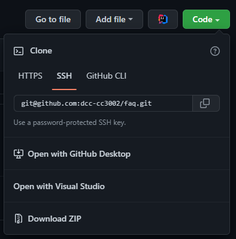
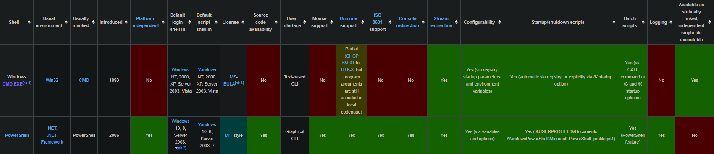

# Fpreguntas Afrecuentes Q

- [Fpreguntas Afrecuentes Q](#fpreguntas-afrecuentes-q)
  - [Programación](#programación)
    - [Leyendo la documentación del lenguaje encontré algo que no vimos en clases. ¿Lo puedo usar?](#leyendo-la-documentación-del-lenguaje-encontré-algo-que-no-vimos-en-clases-lo-puedo-usar)
  - [*IntelliJ*](#intellij)
    - [*IntelliJ* no me pone colores bonitos en mi código Q-Q](#intellij-no-me-pone-colores-bonitos-en-mi-código-q-q)
  - [*Git*](#git)
    - [Descargué mi código directo de *GitHub* no se como conectarlo por *Git* al repositorio D,:](#descargué-mi-código-directo-de-github-no-se-como-conectarlo-por-git-al-repositorio-d)
  - [Linux](#linux)
    - [¿Cómo instalo las herramientas?](#cómo-instalo-las-herramientas)
  - [Mac](#mac)
    - [¿Cómo instalo las herramientas?](#cómo-instalo-las-herramientas-1)
  - [Windows](#windows)
    - [¿Cómo instalo las herramientas?](#cómo-instalo-las-herramientas-2)
    - [¿Cuál es la diferencia entre *cmd* y *Powershell*?](#cuál-es-la-diferencia-entre-cmd-y-powershell)

## Programación

### Leyendo la documentación del lenguaje encontré algo que no vimos en clases. ¿Lo puedo usar?

Sí, pero pregunta antes de hacerlo.
Puedes utilizar cualquier herramienta que provea el lenguaje, pero si no lo hemos visto en clases te 
arriesgas a utilizarlo mal; en este caso, es mejor no ocupar una herramienta a ocuparla mal.


## *IntelliJ*

### *IntelliJ* no me pone colores bonitos en mi código Q-Q

Anda a ``File | Invalidate Caches`` marca todas las checkboxes y espera a que se reinicie 
completamente *IntelliJ*.

## *Git*

### Descargué mi código directo de *GitHub* no se como conectarlo por *Git* al repositorio D,:

Lo más probable es que no hayas clonado correctamente el repositorio.
Para clonarlo debes ir a tu repositorio en *GitHub* y hacer click en el botón ``Code`` (El botón 
verde D:), ahí, dependiendo de cómo hayan configurado *Git* deben copiar el link HTTPS, SSH o GitHub 
CLI.



Luego, con el link copiado, hacen:

```bash
git clone <link HTTPS o SSH>
# Con GitHub CLI sólo tienen que pegar lo que copiaron en la terminal.
# Debiera verse así
gh repo clone <su repo>
```

Ahora comprueben que funciona haciendo:

```bash
# Desde la carpeta de su repo
git status
```

## Linux

### ¿Cómo instalo las herramientas?

Para esto vean las instrucciones de [aquí](Installation.Linux.md)

## Mac

### ¿Cómo instalo las herramientas?

Para esto vean las instrucciones de [aquí](Installation.Mac.md)

## Windows

### ¿Cómo instalo las herramientas?

Para esto vean las instrucciones de [aquí](Installation.Windows.md)

### ¿Cuál es la diferencia entre *cmd* y *Powershell*?

La diferencia es que nunca debieras usar *cmd*.
Hablo en serio.

Pero hablando en serio, *cmd* es una herramienta de 1987 (y la versión actual es de 1993), 
*Powershell* (PS) es una herramienta publicada el 2006 (con actualizaciones hasta la actualidad).
Un error común es creer que los comandos de *cmd* no pueden usarse desde PS, esto es mentira.
La mayoría de los comandos de *cmd* pueden ejecutarse directamente desde PS o tienen 
versiones equivalentes en PS, por ejemplo:

```cmd
REM En cmd podemos "limpiar" la consola con el siguiente comando
cls
```

```powershell
# El mismo comando puede ser usado desde PS
cls
# Ahora si hacemos:
cls -?
```
Obtenemos:

```
NAME
    Clear-Host
...
```

Esto nos indica que en PS ``cls`` es un alias de ``Clear-Host``, esto hace que podamos usar uno o el
otro indistintamente (aunque en PS se recomienda que no se use el alias en scripts para mejorar la 
legibilidad del código).

Por otro lado, tenemos comandos que no tienen un equivalente en PS como ``robocopy`` 
(*Robust Copy*), de nuevo, aquí no hay problemas porque podemos usar ``robocopy`` desde PS de la 
misma forma que lo haríamos en *cmd*

```powershell
robocopy /help
```

Hay otras diferencias que pueden ver en el cuadro de abajo, pero en general PS es mejor que *cmd* en
todos los sentidos.

